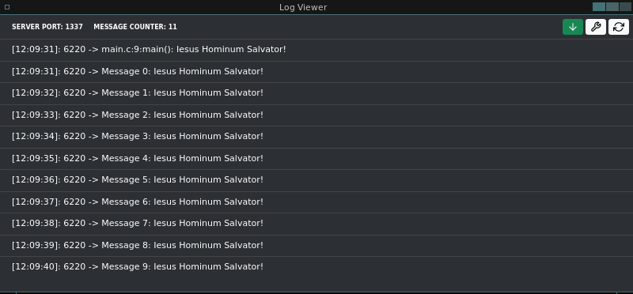

<div align='center'>



</div>

<br>

<p align="center">
    <a href="https://github.com/sponsors/melchisedech333"></a>
    <br><br>
    
    
    
    
    
    
</p>

Language: <a href="readme-pt.md">PT-BR</a>

When you're implementing things like Linux Daemons, or any application where you don't have access to the standard IO, it's nice to have an application to receive messages from your program.

This is exactly what this application does, it connects to a TCP server on port <b>1337</b> (you can edit the port and destination IP address in the file <b>example/debug.h</b>).

In order not to crash the application when sending messages, Non-Blocking Socket techniques are used.

**If my code has helped you, please consider [sponsoring me](https://github.com/sponsors/melchisedech333) :blue_heart:** 

<br>

:computer: Usage example
---

Just add the <b>debug.h</b> header in your application, and use it as shown in the code below.

<br>

```c
#include "debug.h"

int main (int argc, char *argv[])
{
    /**
     * Detailed message example.
     */
    say_debug_detail("Iesus Hominum Salvator!");

    /**
     * Example of common usage.
     */
    
    for (int a=0; a<10; a++) {
        say_debug("Message %d: Iesus Hominum Salvator!", a);
        sleep(1);
    }

    return 0;
}
```

To use the message visualization application (as shown in the image above), just open it using Electron. Remembering that the Electron version used is 19.0.0, and you can find it here: https://github.com/electron/electron/releases/tag/v19.0.0

All you need to do is run Electron, and specify the application directory in its parameters.

```bash
electron .
```

<br>

:smiley: Author
---

Sponsor: [melchisedech333](https://github.com/sponsors/melchisedech333)<br>
YouTube: [Melchisedech](https://www.youtube.com/channel/UC4Sh4wxncr5arnydpUfWPKw)<br>
Twitter: [Melchisedech333](https://twitter.com/Melchisedech333)<br>
Blog: [melchisedech333.github.io](https://melchisedech333.github.io/)<br>
LinkedIn: [Melchisedech Rex](https://www.linkedin.com/in/melchisedech-rex-724152235/)


<br>

:scroll: License
---

[ BSD-3-Clause license](./license)

<br><br>

<div align="center">

## Remember to give me <br> a beautiful little star :star_struck:

</div>


